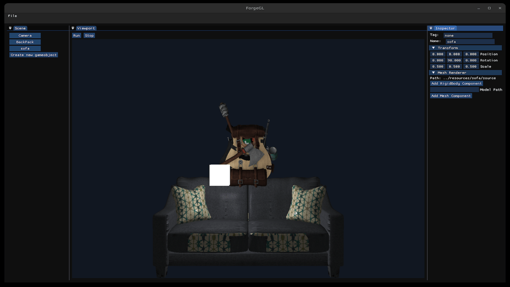

# ForgeGL

ForgeGL is a C++ OpenGL-based 3D editor and runtime prototype built around an ECS architecture. It combines model loading, scene editing, basic physics, and ImGui tooling into a single desktop application for building and previewing simple scenes.



## What It Does

- Loads and renders imported 3D models with Assimp
- Uses EnTT for entity-component management
- Provides an ImGui editor with:
  - Scene hierarchy
  - Inspector panel
  - Viewport panel
  - Menu for opening saved scenes
- Supports scene serialization to JSON
- Integrates ReactPhysics3D for rigid body simulation
- Renders the editor viewport to an offscreen framebuffer
- Supports basic camera movement and runtime play/stop mode

## Tech Stack

- C++
- OpenGL
- GLFW
- GLAD
- GLM
- ImGui
- EnTT
- Assimp
- stb_image
- ReactPhysics3D
- nlohmann/json

## Editor Features

- Create game objects with `Transform` components
- Edit object name and tag in the inspector
- Add `MeshRenderer` and `RigidBody` components
- Load saved scenes from JSON
- Save scene state back to disk
- Toggle between editor and runtime state from the viewport

## Controls

- `W`, `A`, `S`, `D`: move the editor camera
- `Run`: enter runtime mode
- `Stop`: exit runtime mode

## Build

The project is configured with CMake.

```bash
mkdir -p build
cd build
cmake ..
cmake --build .
```

If you use the provided helper script, make sure the build directory already exists and the executable name matches your local generator output.

## Project Layout

- `src/engine/core/` - engine loop, scene loading/saving, physics, rendering coordination
- `src/engine/editor/` - ImGui editor panels and runtime controls
- `src/engine/renderer/` - shader, mesh, model, and window helpers
- `src/components/` - ECS component definitions
- `shaders/` - GLSL vertex and fragment shaders
- `resources/` - sample models and textures

## Notes

- This is a personal learning project, so the code favors experimentation over production hardening.
- Scene serialization, component editing, and runtime simulation are already implemented, but the architecture can still be polished further.
- Some resource ownership is still managed with raw pointers.